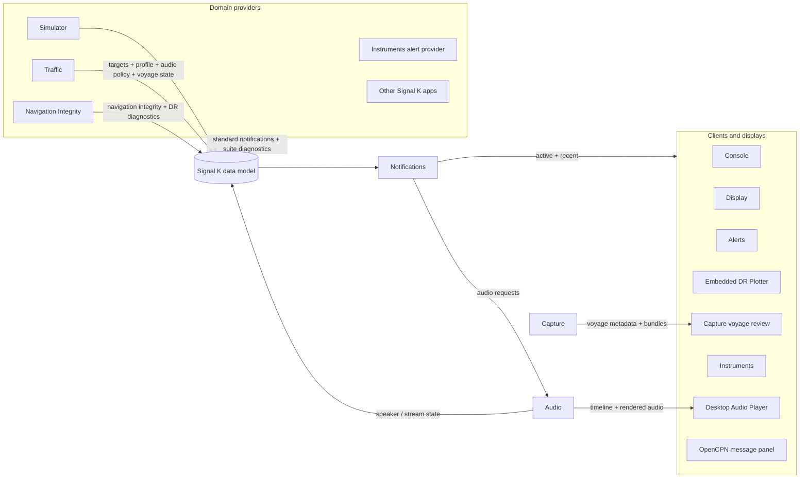

# AJRM Marine Suite Architecture 2026

Status: current public beta architecture  
Date: 2026-08-08
Applies to: AJRM Marine public repositories under `ajrm-marine-suite`

## 1. Design Intent

AJRM Marine is a suite of Signal K plugins and webapps intended to improve
small-vessel situational awareness and provide a repeatable test environment
for live sailing, replay, and debugging.

The suite is deliberately not one large plugin. It is a set of focused apps
connected through Signal K data paths, standard notifications, and documented
suite projections.

The design principles are:

1. **Backend authority.** Plugins calculate safety, navigation, recording, and
   diagnostic state. Browser clients render published state and send explicit
   commands.
2. **Signal K first.** Standard Signal K paths, deltas, notifications,
   resources, metadata, security, and subscriptions are the public integration
   layer.
3. **Small authorities.** Traffic owns AIS encounter meaning. Audio owns the
   audible timeline. Navigation Integrity owns source selection, GPS/DR trust,
   and operational dead reckoning. Capture owns canonical recording, replay,
   voyage bundling, and voyage review.
4. **No hidden client policy.** Display, Console, Alerts, Capture review,
   Navigation Integrity's DR Plotter, Instruments, desktop audio players, and OpenCPN panels must not
   reimplement safety decisions from prose or private assumptions.
5. **Observable by design.** A voyage capture should contain enough Signal K
   state, diagnostics, snapshots, and BITE results to explain what happened
   later.
6. **Safety humility.** The suite assists awareness and testing. It is not a
   certified navigation, collision-avoidance, anchoring, or GPS-integrity
   system.

## 2. Application Groups

### Core Sailing Suite

| App | Package | Responsibility |
| --- | --- | --- |
| AJRM Marine Console | `signalk-ajrm-marine-console` | Suite entry point, help, BITE, app status, tabbed workspace |
| AJRM Marine Traffic | `signalk-ajrm-marine-traffic` | AIS CPA/TCPA, encounter wording, profiles, voyage state, audio policy |
| AJRM Marine Display | `signalk-ajrm-marine-display` | Chart display, traffic rendering, profile controls, visual alert panel |
| AJRM Marine Notifications | `signalk-ajrm-marine-notifications` | Active/recent notification projection, lifecycle, deduplication |
| AJRM Marine Audio | `signalk-ajrm-marine-audio` | Piper rendering, audio queue, speaker/stream/desktop-player delivery |
| AJRM Marine Alerts | `signalk-ajrm-marine-alerts` | Read-only compact alert display for crew devices |
| AJRM Marine Capture | `signalk-ajrm-marine-capture` | Canonical recording and replay, voyage orchestration, comments, snapshots, portable debug bundles, and voyage review |

### Navigation Integrity

| App | Package | Responsibility |
| --- | --- | --- |
| AJRM Marine Navigation Integrity | `signalk-ajrm-marine-gps-integrity` | Source-aware heading/track reference, WMM variation, GPS trust evaluation, DR calculations, plotted fixes, track history, and embedded DR Plotter |

### Voyage Review and Replay

| App | Package | Responsibility |
| --- | --- | --- |
| AJRM Marine Capture review | `signalk-ajrm-marine-capture` | Analyse voyage bundles, plot tracks, summarise GPS/DR and alerts |
| AJRM Marine Snapshot | `signalk-ajrm-marine-snapshot` | System and plugin diagnostics snapshot |

### Instruments and Environment

| App | Package | Responsibility |
| --- | --- | --- |
| AJRM Marine Instruments | `signalk-ajrm-marine-instruments` | Large-format instrument display plus depth, wind, temperature, and other instrument alerting |
| AJRM Marine Harbour Editor | `signalk-ajrm-marine-harbour-editor` | Local harbour/anchorage regions and profile boundaries |
| AJRM Marine Vessel Database | `signalk-ajrm-marine-vessel-database` | Local vessel names, sizes, and lookup enrichment |

### Operations and Testing

| App | Package | Responsibility |
| --- | --- | --- |
| AJRM Marine Simulator | `signalk-ajrm-marine-simulator` | Own-vessel, AIS vessel, environment, GPS/GNSS, route, and failure simulation |
| AJRM Marine Pi Controller | `signalk-ajrm-marine-pi-controller` | Server telemetry and Raspberry Pi helper actions such as Piper install |
| AJRM Marine Audio Player | `ajrm-marine-audio-player` | Desktop audio client for macOS, Linux, and Windows |

## 3. Main Data Flow

## 4. Authority Boundaries

### Traffic

Traffic is the AIS encounter authority. It calculates CPA/TCPA, encounter type,
target priority, action-prompt wording, profile, stationary automute, and the
suite's `voyageState` projection.

Traffic publishes standard Signal K notifications so non-AJRM clients can still
display meaningful alerts. AJRM clients may consume richer Traffic projections,
but they must not reverse-engineer meaning from message text.

Traffic carries AIS Class A/B only when fresh physical receiver provenance
supports the report. Unknown or conflicting class remains explicit rather than
being guessed from vessel size or behaviour. It also preserves an explicit
`null` rate of turn so renderers clear stale turn indicators.

### Notifications

Notifications applies generic mechanics: active/recent state, lifecycle,
deduplication, expiry, priority ordering, and audio-request projection. It does
not decide what a collision, GPS fault, or depth condition means.

Notifications runtime state is session-scoped. Providers republish current
conditions after restart.

Instrument Alerts distinguishes one-shot anchoring depth callouts from a
continuing shallow-depth condition. Callouts expire or clear when safely outside
their band; the separate below-keel alert remains active until its threshold and
hysteresis resolve.

### Audio

Audio owns the audible timeline. It renders Piper speech once, applies the
queueing/supersession rules, and exposes one authoritative timeline to server
speaker, stream, browser, desktop player, and diagnostic consumers.

Outputs are sinks. They do not reorder, reprioritise, or reinterpret
announcements.

### Navigation Integrity

Navigation Integrity first selects a source-aware bow heading and coherent
ground track, including local WMM magnetic variation and explicit provenance.
It then evaluates GPS/GNSS against movement, signal quality, position jumps,
lost fixes, and dead-reckoning checks. Its embedded DR Plotter displays
operational dead reckoning, estimated positions, observed fixes, uncertainty,
vectors, and plot history. When GPS is lost, DR uses the last reliable current
set/drift rather than assuming live current data will continue.

The historic Navigation Reference and DR Plotter provider identities, Signal K
paths, runtime APIs, configuration, and data directories remain stable inside
the combined package. The standalone packages are retired and must not run
alongside it.

### Capture and Snapshot

Capture owns canonical physical-input recordings, replay, voyage start/stop,
timestamped observation JSONL, optional structured diagnostic Snapshot evidence,
parent/child replay lineage, portable bundles, and read-only voyage analysis and
plotting. Snapshot owns point-in-time system diagnostic collection. The former
standalone Logger and Voyage Viewer packages are retired and are not part of
the active suite architecture.

Replay should republish source data rather than derived outputs where possible,
so current plugin logic can be exercised again.

### Simulator and BITE

Simulator is a test data source, not a safety authority. It must be switchable
off and default safe for real sailing.

BITE is hosted by Console and uses the installed plugins through their public
Signal K/API surfaces. BITE should catch broken end-to-end behaviours, not
duplicate every unit test.

## 5. State and Persistence

Persistent:

- Plugin configuration.
- Harbour/anchorage regions.
- Vessel database entries.
- Capture canonical recordings, voyage bundles, observation logs, optional evidence, and replay
  lineage.
- Navigation Integrity DR plotted fixes and track history where configured.
- BITE result summaries.

Session-scoped:

- Active notification broker state.
- Audio queue and playback lifecycle.
- Traffic target runtime cache.
- Simulator output state.
- Display map interaction state unless explicitly stored as a preference.

The design favours explicit restart behaviour. If Signal K restarts, live safety
state is rebuilt from fresh inputs instead of replaying stale runtime state.

## 6. Units and Presentation

Internal calculations and logs use Signal K standard units. User-facing display
and speech convert units as late as possible, using Signal K/user preferences
where available.

Speech should avoid clutter that does not add meaning. For example, spoken CPA
distances can say "miles" or "meters" without unnecessary qualifiers, and
unknown MMSI-only target identifiers should not be spoken as long numbers.

## 7. Security and Access

The suite must work with Signal K security enabled. Read-only access should be
sufficient for read-only clients such as Alerts, desktop audio playback, and
OpenCPN message display. Write access is required only for deliberate control
actions such as changing profile, starting/stopping capture, or running BITE.

Plugins should expose clear degraded states when optional dependencies are
missing, such as Piper, Pi Controller, charts, or optional alert-display apps.

## 8. Publication Model

Each runtime app is an independent public repository and npm package under the
`ajrm-marine-suite` organisation. Console is the suite entry package and help
surface. This architecture repository is the canonical suite-level design
record, with a curated "Suite Architecture" doorway exposed from Console.

The software repos use `AGPL-3.0-or-later`. This documentation repo has a
separate restricted documentation licence.
